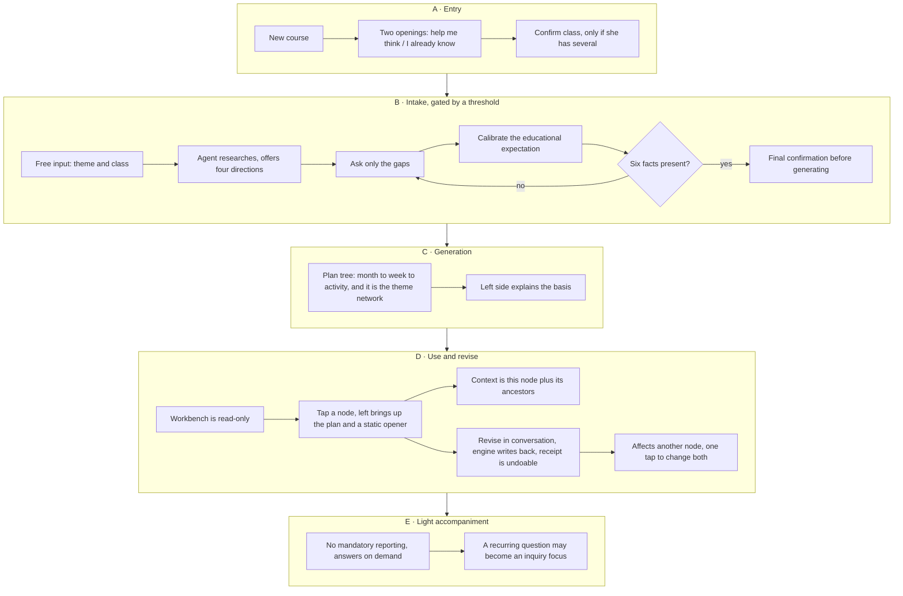

# Workflow v2 — Little Explorers

Status: ratified at the 2026-07-28 team meeting · written 2026-07-29 · Chinese twin: [WORKFLOW.zh-CN.md](WORKFLOW.zh-CN.md)

Source: [source-docs/20260728_Team Meeting.md](../source-docs/20260728_Team%20Meeting.md) (verbatim transcript). Decisions are recorded in [ADR-0006](adr/0006-workbench-first-plan-tree.md), [ADR-0007](adr/0007-tiered-context-and-change-propagation.md), [ADR-0008](adr/0008-v1-scope-amendment.md), [ADR-0009](adr/0009-teacher-interaction-axes.md), [ADR-0010](adr/0010-conversation-and-workbench-model.md), [ADR-0011](adr/0011-memory-scopes-and-serialization.md).

Diagram: [docs/assets/workflow-v2.drawio](assets/workflow-v2.drawio), open in draw.io desktop or diagrams.net. The flowchart below carries the same content as text.

## 1. How this relates to V1.3

V1.3 was an interlocking chain of nodes: no child question meant no progress, and each step unlocked on a 回传. The meeting confirmed that this chain largely disappears in v1 — 陈栩锋's words were 「全部消失的」, and 林朝湃 judged the change 「会极大的」.

What survives is not a chain but **a tree plus a conversation**. V1.3 stage 2 onward remains the upstream spec and will be reconciled later; this document describes only what v1 actually runs.

In one sentence: **the teacher says what she wants, the agent grows a whole month of plan in one pass, and after that she taps wherever she wants to talk.**

**Dropping the chain does not mean dropping the harness.** The meeting was explicit about both halves — 「可能我们也不能说放弃，我们弄一个去芜存菁的 harness…只是把一些大方向它要拒绝掉，小的里面它在里面像小沙盒一样，就让他自己去玩。」 What remains guards the shell of the conversation rather than its steps: this tool builds preschool theme-inquiry courses, so asking it for the weather in Changsha is refused before the call is made — 冯浩然 had already done exactly that through web search, and every such turn burns money the team pays. Evidence rules and structural checks are untouched. Stage gates and node prerequisites lapse with the chain. Details in [ADR-0012](adr/0012-runtime-harness-after-the-workflow.md).

The boundary is judged on purpose, not keywords. 「长沙今天天气怎么样」 is out; 「明天下雨的话，周二那个户外龙舟活动怎么办」 is course work and must sail straight through.

## 2. The whole flow

## 3. A · Entry

The teacher starts a course and sees two openings, not two modes:

- **帮我想想做什么** — the agent asks first, starting from a question card and building up.
- **我已经有想法了** — she types, and the agent delivers a first plan in the same turn, asking only about gaps.

By the third turn the two converge into one product. Nothing is stored, nothing locks, and she shifts between them simply by talking differently. This avoids building and maintaining two flows, and it lets both sides of the meeting's opening argument see their half of it survive.

A teacher with more than one class is asked once which class this course is for; with a single class it is assumed silently. A class is a named object, distinct from the age-band field.

## 4. B · Intake, by threshold rather than round count

陈栩锋 demonstrated four rounds, but the meeting fixed a more important rule alongside it: **it does not have to be four**. Once the agent judges it holds the six facts, it can generate.

- Round one: free input in plain words — 「我想带中班的小朋友做东乡龙舟的主题探究活动」.
- The agent catches the resource, researches its history, origins, customs and characteristics, offers four directions the theme could take, then says what it still needs to know.
- The teacher fills gaps: what the children have already seen, what resources are nearby, how many weeks she plans.
- Calibration: 「你希望一个月后孩子发生怎样的变化？」 — this is what tells the agent *why* she is running this theme.
- One last confirmation before generating, e.g. 「第一周能否安排去一次训练场探访」.

The complete list of **six facts** lives in the message 陈栩锋 sent to the group; the transcript only names some of them — age band, children's existing experience, why the teacher is running this theme, duration, and the real resources within reach. Confirm the full list with him before it reaches code.

Nothing appears on the right during this phase. 陈栩锋's instruction was 「右侧我觉得可以先什么都不出」 — let her watch the conversation rather than a half-built artifact.

## 5. C · Generation

After confirmation the right side grows the whole plan tree in one pass:

- **The root is a 月计划**, meaning one continuous stretch of teaching of roughly two to five weeks, not a calendar month. 锋's stage one was always two to three weeks.
- **Weekly plans are the theme's sub-nodes.** 林朝湃's framing: if you are running one theme this month, you decide which four or five aspects of it the four or five weeks will each cover.
- **Activities hang under weeks and carry their own dates.** A day is not a level, it is a field on the activity — so 「今天要做什么」 is a filter, not a place.

**This tree is also the theme network map.** This is the sentence most easily lost from the meeting: 龙舟 is both the theme's starting node and the 月计划; 周1 船体 and 周2 协作 are both weekly plans and the theme's sub-nodes. 「他们是同一个东西来。」 So there is no second network diagram to generate, reconcile or maintain.

As the tree appears, the left side explains conversationally: why it is arranged this way, what the children might gain, and what to watch for in week one.

## 6. D · Use and revise

**The right side is read-only; the left is the only place to talk to the agent.** The meeting confirmed this repeatedly: 「右边只能打开只读，所有的修改都在左边完成。」

Tapping a node brings that node's activity plan up on the left, with one opening line — 「老师，你在这个方案里面有什么疑问或者修改，都可以跟我说」. That line is **static, drawn at random from a fixed set, and shown to the teacher only**. It never enters the API context, or the pollution would be severe.

A node's context is the **minimum necessary set**: the node itself plus its ancestor plans. Revising 3.2.1 brings 3.2, 3.1 and the 月计划 — not the long conversation that produced them.

The engine writes changes back to the node and the teacher sees an undoable receipt. When a change affects another node, the agent offers 「一起改」 inside the conversation; nothing moves until she taps it, and the downstream node is otherwise flagged 待复查 with a note of what changed upstream.

There is no 调整 button and no ✓确认 button. Confirmation becomes an engine event, but one that must cite the teacher's own words from that turn — no citation, no confirmation.

## 7. E · Light accompaniment

**Reporting is not required.** Teachers resist the act of feeding information back, and the meeting had field evidence for it: at the experiment kindergarten's round table, after the 园长 approved the direction and invited comment, a teacher said 「最好分析批注都不要让我们写，你们要有个 AI 帮我来分析吧，因为我们的工作量太大了」, and the technical review turned into a complaints session on the spot.

So observation points are guidance, not obligation, and this version centres on answering questions whenever they arise. She reports when she wants to.

`核心驱动问题` is not forced. 叶老师's deep-learning approach has no driving question either; a focused inquiry point is enough. If children keep asking the same thing and the teacher mentions it inside some activity, the agent can then judge whether to consolidate it into an inquiry focus and adjust the later plans.

## 8. What a node holds

林朝湃's principle: anything belonging to a node goes inside that node, because it will serve as background for its sub-nodes.

- Theme positioning and educational value — why it is designed this way
- The thinking it targets, the abilities to develop, and a judgement of the children's existing experience
- The activity plan itself, plus guidance on how to run it
- Observation points, as a prompt rather than a requirement
- Resources and preparation: materials and people, effectively the teacher's memo
- Why this node reads as it does: what was heard, what was assumed, the teaching basis, the reason for each change

The definitive content schema is 林朝湃's to confirm, and the node detail view is blocked on it. 陈栩锋 is separately turning the dialogue flow he demonstrated into a written document.

## 9. Four memory scopes

Context does not travel between conversations. Every conversation reads the same tree and writes to the same tree; what is not written down did not happen.

| Scope | Holds | Lifetime |
|---|---|---|
| Node | why this node reads as it does | the node |
| Course | facts about this theme | the course |
| Class | no drums, several noise-averse children, no outdoor space in rain | the class, across courses |
| Teacher | the six interaction axes, long-run preferences | permanent |

The class scope exists specifically so she does not repeat herself at the start of a new theme: finish 龙舟 in September, start 中秋灯笼 with the same children, and if constraints lived only at course level the agent would propose drums again.

Facts are extracted automatically and never through a form. Capture surfaces immediately as an undoable toast — one-tap undo is what makes automatic extraction safe. Extraction defaults to course scope; widening to class or teacher is the teacher's deliberate act, because filing too narrowly costs one repetition while filing too broadly follows her into every future course.

## 10. What was removed

| Removed | Why |
|---|---|
| 资源深度网络图 | Duplicates the plan tree. 陈栩锋 proposed removing it, 林朝湃 agreed twice: 「我们只要一个计划的网络」 |
| Mandatory `核心驱动问题` | Deep learning never had one; a focused inquiry point is enough |
| Mandatory 回传 and required observation points | Teachers resist it; downgraded to guidance |
| The ✓确认 button | Teachers will not tap it a dozen times; replaced by a citation-backed engine event |
| The 调整 branch button | Anything a conversation can do should not become a button |
| The 问题卡 tab in the workbench | Cards return to the conversation, with a pending strip so none are lost |
| V1.3's unlock-style node chain | v1 no longer gates progress on reporting |

## 11. Still open

1. Whether a node conversation carries its own earlier history. 林朝湃 argued it should not (「历史对话就没有了」); Herman argued for one conversation with a node reference attached. See [ADR-0010](adr/0010-conversation-and-workbench-model.md) §1a.
2. The complete list of six facts, per 陈栩锋's message to the group.
3. The required content schema for an activity plan — 林朝湃 owns it.
4. Whether 月计划 is a document submitted on a monthly cycle. If it is, the root must align to calendar months.
5. Token and cost measurement for tiered context — 冯浩然 owns it — plus the cache cost of switching between nodes.
6. Layout: v1 ships the left/right split; the floating dialogue and a customizable arrangement are deferred; phones show one side at a time.

## 12. Where academic depth goes

林朝湃's judgement: no heavy training is needed, because the model already carries close to a century of pedagogical thinking and will not propose drilling literacy at preschoolers. What the business needs is language for it, so hand 叶老师's writing on deep learning to a model, distil no more than ten principles, put one copy in the system prompt and one in the deck.

Cultural resources are collected along the lines of the 画龙 resource library: the shell is the ordinary framework of the kindergarten day and does not change; only the local content inside it does — pictures, materials, people who can come and share what they know. The same shell holds in any other district.
