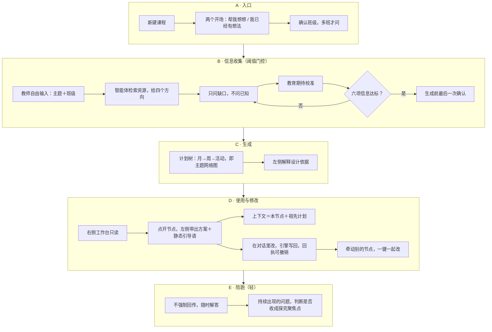

# 工作流 v2 — 小小探索家

状态：2026-07-28 团队会议共识 · 本文写于 2026-07-29 · 英文孪生文档 [WORKFLOW.md](WORKFLOW.md)

依据：[source-docs/20260728_Team Meeting.md](../source-docs/20260728_Team%20Meeting.md)（逐字稿）。决策记录见 [ADR-0006](adr/0006-workbench-first-plan-tree.md)、[ADR-0007](adr/0007-tiered-context-and-change-propagation.md)、[ADR-0008](adr/0008-v1-scope-amendment.md)、[ADR-0009](adr/0009-teacher-interaction-axes.md)、[ADR-0010](adr/0010-conversation-and-workbench-model.md)、[ADR-0011](adr/0011-memory-scopes-and-serialization.md)。

图：[docs/assets/workflow-v2.drawio](assets/workflow-v2.drawio)，用 draw.io 桌面版或 diagrams.net 打开。下面的流程图是同一份内容的文字版。

## 1. 这份工作流跟 V1.3 的关系

V1.3 是一条环环相扣的节点链：没有儿童问题就不能往下走，每一步靠回传解锁。会上确认这条链在第一版里基本不再出现——用锋的话说是「全部消失的」，朝湃的判断是「会极大地（改变）」。

留下来的不是链，是**一棵树加一段对话**。V1.3 的阶段二及以后仍是上游规范，等回头再对齐；本文只描述第一版实际要跑的东西。

一句话概括：**老师说清楚要做什么，智能体一次把整个月的计划长出来，之后老师点哪里就聊哪里。**

**砍掉链条不等于砍掉护栏。** 会上把两半都说清楚了——「可能我们也不能说放弃，我们弄一个去芜存菁的 harness……只是把一些大方向它要拒绝掉，小的里面它在里面像小沙盒一样，就让他自己去玩。」 留下来的那部分守的是对话的壳，不是对话的步骤：这个工具是拿来做学前主题探究课程的，所以问它长沙今天天气怎么样，在发出请求之前就要挡掉——浩然此前正是这样用联网搜索问过一次，而每一次这样的对话烧的都是团队自己的钱。证据规则和结构检查原样保留；阶段关卡与节点前置条件随链条一起作废。细节见 [ADR-0012](adr/0012-runtime-harness-after-the-workflow.md)。

边界看的是目的，不是关键词。「长沙今天天气怎么样」要挡；「明天下雨的话，周二那个户外龙舟活动怎么办」是课程工作，必须原样放行。

## 2. 全流程

## 3. A · 入口

老师新建一门课，看到两个开场，不是两种模式：

- **帮我想想做什么** — 智能体先问，用问题卡起步，一步步搭。
- **我已经有想法了** — 老师直接说，智能体当轮就给方案，只补缺口。

第三轮之后两条路收敛成同一个产品。不存偏好，不锁模式，老师换个说法就换了节奏。这样做是为了不必建两套流程，也让会上「卡片派」和「对话派」各自看到自己那一半。

多班的老师会被问一次这门课带哪个班；只有一个班就默认，不问。班级是个有名字的对象，跟年段字段不是一回事。

## 4. B · 信息收集，用阈值而不是轮数

会上锋演示的是四轮，但同时定了一条更要紧的规则：**不一定要问四轮**。智能体判断自己拿齐了六项信息，就可以开始生成。

- 第一轮：老师自由输入，大白话就行——「我想带中班的小朋友做东乡龙舟的主题探究活动」。
- 智能体接住资源，联网梳理历史、由来、习俗、特点，给出四个可走的方向，然后说明还需要知道什么。
- 老师补齐：孩子看过什么、身边有什么资源、打算做几周。
- 教育期待校准：「你希望一个月后孩子发生怎样的变化？」这句用来判断老师为什么要开这个主题。
- 生成前最后一次确认，例如「第一周能否安排去一次训练场探访」。

**六项信息**的完整清单以锋发到群里的那条消息为准，逐字稿里只念到其中几项：班级年龄段、儿童已有经验、老师为什么开展这个主题、周期、身边真实的资源条件。收进代码前要跟锋核对完整版。

这一段右侧**不出计划**，但也不是一片空白。锋的原话是「右侧我觉得可以先什么都不出」——意思是别一上来就给半成品，不是让老师对着一块空板子说话。

右侧这时是**第零步面板**：一句话说明这块面板会长出什么、一份「还差哪几件事」的清单（随着对话自己勾掉，只报告不追问）、以及一个折叠起来的样例，想看的人点开看。计划一旦真的建起来，这块面板**整块换掉**，换成计划树——不是在下面接着长，是清空重画（`main.js` 里就是一次 `replaceChildren`）。

门槛到了就换，不等这一段走完：老师如果一上来就说「我已经有想法了」，同一轮就该看见树。**换的条件是「够不够」，不是「走到第几段」**。

## 5. C · 生成

确认之后，右侧一次性长出整棵计划树：

- **根是月计划**，指一段连续的教学，大约二到五周，不切自然月。锋版阶段一本来就是二到三周。
- **周计划是主题的分节点**。朝湃的说法：一个月要开展一个主题，就想接下来四五个周分别围绕这个主题的哪些点。
- **活动挂在周下面，自己带日期**。日不是一层，是活动上的一个字段——因此「今天要做什么」是一次筛选，不是一个位置。

**这棵树同时就是主题网络图。** 这是会上最容易被漏掉的一句：龙舟既是主题的起点，也是月计划；周1 船体、周2 协作既是周计划，也是主题的分节点。「他们是同一个东西来。」所以没有第二张网络图要生成、要对齐、要维护。

树长出来的同时，左侧用对话的口吻说明：为什么这么安排、孩子可能获得什么、第一周重点看什么。

## 6. D · 使用与修改

**右侧只读，左侧是唯一跟智能体说话的地方。** 这条是会上反复确认过的：「右边只能打开只读，所有的修改都在左边完成。」

点开一个节点，左侧带出这个节点的活动方案，加一句引导语——「老师，你在这个方案里面有什么疑问或者修改，都可以跟我说」。引导语是**静态的、随机取一句、只给老师看**，绝不进 API 上下文，否则污染会很严重。

节点的上下文是**最小必要集**：这个节点，加上它的祖先计划。要改 3.2.1，就带 3.2、3.1 和月计划，不倒进之前的长对话。

改动写回节点由引擎完成，老师看到一条可撤销的回执。牵动到别的节点时，智能体在对话里给一个「一起改」，点了才动；没点就在下游标一个待复查，说明上游改了什么。

没有「调整」按钮，没有「✓确认」按钮。确认变成引擎事件，但要求引用老师当轮的原话，引不出来就不算确认。

## 7. E · 陪跑（轻）

**不强制回传。** 老师抗拒信息回流的动作，这一点会上有实地依据：实验园的圆桌会上，园长拍板之后请老师提意见，老师说「最好分析批注都不要让我们写，你们要有个 AI 帮我来分析吧，因为我们的工作量太大了」，技术研讨会当场变成吐槽大会。

所以重点观察只作提示，不作要求；这一版以随时解答为重心。老师愿意说的时候再说。

`核心驱动问题`不强求。叶老师那套深度学习里本来也没有核心驱动问题，只要找到聚焦的探究点就够。如果孩子反复问同一件事，老师在某个活动里提了，智能体再判断要不要收成一个探究聚焦点、要不要调整后面的计划。

## 8. 一个节点里装什么

朝湃的原则：跟节点有关的内容就放进这个节点，因为它接下来还要当子节点的背景资料。

- 主题定位与教育价值——为什么这么设计
- 重点思维、想发展的能力、对儿童已有经验的判断
- 活动方案本身，加活动指引：怎么开展
- 重点观察（提示，不是要求）
- 资源与准备：材料、人物，相当于老师的备忘录
- 这个节点为什么长这样：听到你说、我据此猜、教学依据、改动理由

完整的必备内容框架由朝湃确认，节点详情视图卡在这一项上。锋另外会把他演示的那套对话流修订成文档。

## 9. 记忆四层

上下文不在对话之间传递。每一段对话都读同一棵树、写同一棵树；没写进去的就等于没发生。

| 层 | 装什么 | 活多久 |
|---|---|---|
| 节点 | 这个节点为什么长这样 | 节点 |
| 课程 | 这门课的事实 | 这门课 |
| 班级 | 班上没有鼓、几个孩子怕大声、下雨没有户外场地 | 这个班，跨课程 |
| 教师 | 交互画像六维度、长期偏好 | 一直 |

班级这一层是专门为「换主题不用重讲」加的：九月做完龙舟，同一批孩子做中秋灯笼，如果限制只存在课程层，智能体又会提议敲鼓。

事实是自动提取的，永远不做表单。提取的当下弹一个可撤销的提示；能一键撤销，自动提取才安全。默认写课程层，往上扩到班级或教师要老师自己动手——写窄了只是让她重讲一次，写宽了会跟着她进以后每一门课。

## 10. 这一版删掉了什么

| 删掉的 | 为什么 |
|---|---|
| 资源深度网络图 | 与计划树重复。锋提出删，朝湃同意两次：「我们只要一个计划的网络」 |
| 强制`核心驱动问题` | 深度学习本来就没有；只要探究聚焦点 |
| 强制回传、必答的观察点 | 老师抗拒；改为提示 |
| ✓确认按钮 | 老师不会去点十几次；改为引用原话的引擎事件 |
| 调整分支按钮 | 该用对话完成的事不做成按钮 |
| 工作台的问题卡页签 | 卡片回到对话里，用一条待答提示条兜住 |
| V1.3 的解锁式节点链 | 第一版不再靠回传解锁 |

## 11. 还没定的

1. 节点对话要不要带上它自己之前的历史。朝湃主张不带（「历史对话就没有了」），Herman 主张同一条对话贴一个节点引用。见 [ADR-0010](adr/0010-conversation-and-workbench-model.md) §1a。
2. 六项信息的完整清单，以锋群里那条消息为准。
3. 一个活动方案的必备内容框架，朝湃负责。
4. 月计划是不是老师要按月上交的文件。是的话，根节点要改回自然月。
5. 分层上下文的 Token 与成本实测，浩然负责；同时要测节点之间切换的缓存代价。
6. 界面：第一版左右分栏，浮动对话框和自定义布局延后；手机一次只显示一边。

## 12. 学术深度怎么放进去

朝湃的判断：不需要训练太多，大模型已经吸收了近百年的教育理念，不会教小学化识字那一套。商务上需要说辞，就把叶老师关于深度学习的著作交给模型，提炼不超过十句理念，一份进系统提示词，一份进 PPT。

文化资源层沿着画龙资源库的思路收集：壳是幼儿园一日生活的那些框架，不变；变的是壳里装的本地内容——图片、材料、可以来分享经验的人。换到别的区一样成立。
